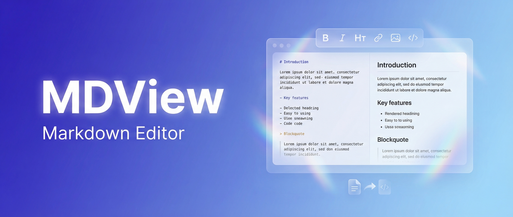

<div align="center">

# MDView

> **한글 친화 마크다운 에디터** — HWP를 마크다운으로, 마크다운을 HWP로

[](https://github.com/revfactory/mdview/actions/workflows/ci.yml)
[](https://github.com/revfactory/mdview/actions/workflows/codeql.yml)
[](LICENSE)
[](https://nextjs.org)
[](https://react.dev)
[](https://www.typescriptlang.org)

**한국어** | [English](README.en.md)

<br />



</div>

## 📖 소개

**MDView**는 마크다운 문법을 전혀 몰라도 워드프로세서처럼 직관적으로 문서를 작성할 수 있는 블록 기반 WYSIWYG 마크다운 에디터입니다. 내부적으로는 순수 마크다운(`.md`)으로 저장되어 어떤 플랫폼에서도 호환됩니다.

세 가지 핵심 차별점:

1. **🇰🇷 HWP 브릿지** — HWP/HWPX(한글 문서)를 마크다운으로 임포트하고, 마크다운을 HWPX로 내보낼 수 있습니다.
2. **⚡ 대용량 처리** — Web Worker 파싱·가상 스크롤·페이지네이션으로 1000+ 페이지 문서도 끊김 없이 다룹니다.
3. **🧱 블록 기반 편집** — Notion 스타일의 슬래시 명령어, 드래그 앤 드롭으로 직관적으로 편집합니다.

> ⚠️ 현재 0.1.x 사전 릴리즈 단계입니다. minor 업데이트에 breaking change가 포함될 수 있습니다.

## ✨ 주요 기능

- **블록 기반 WYSIWYG 편집** — 헤딩, 리스트, 코드, 인용문, 체크리스트, 테이블, 이미지
- **슬래시(/) 명령어** — 블록 타입 즉시 전환·삽입
- **드래그 앤 드롭** — 블록 단위 재배치
- **HWP/HWPX 임포트·내보내기** — 한글 문서를 마크다운으로, 마크다운을 한글 문서로
- **마크다운 파일 임포트·내보내기** — `.md` 직접 열기/저장
- **PDF 내보내기** — 깔끔한 인쇄용 스타일
- **소스/Split 뷰** — WYSIWYG ↔ 마크다운 원본 전환
- **대용량 문서 페이지네이션** — 300KB 이상 문서는 자동 청크 분할
- **전문 검색** — FlexSearch 기반 (Web Worker 실행)
- **자동저장** — IndexedDB (Dexie.js) 로컬 저장
- **다크/라이트 테마** — 시스템 설정 연동
- **수식 렌더링** — KaTeX
- **코드 구문 강조** — Shiki
- **목차(TOC) 자동 생성**
- **PWA 지원** — 오프라인에서도 사용 가능
- **반응형 디자인** — 데스크톱·태블릿·모바일

## 🖼 데모

> 곧 추가됩니다. `docs/screenshots/` 디렉토리에 스크린샷과 GIF가 추가될 예정입니다.

## 🚀 빠른 시작

### 사전 요구사항

- Node.js 20 LTS 이상
- npm (또는 pnpm/yarn)

### 설치 및 실행

```bash
git clone https://github.com/revfactory/mdview.git
cd mdview
npm install
npm run dev
```

브라우저에서 [http://localhost:3000](http://localhost:3000) 접속.

### 프로덕션 빌드

```bash
npm run build
npm run start
```

## 🛠 기술 스택

| 영역 | 기술 |
|------|------|
| **Framework** | Next.js 16 + React 19 |
| **언어** | TypeScript 5 (strict) |
| **에디터 코어** | TipTap 3 (ProseMirror 기반) |
| **스타일** | Tailwind CSS 4 |
| **로컬 데이터베이스** | Dexie.js 4 (IndexedDB) |
| **상태 관리** | Zustand 5 + dexie-react-hooks |
| **검색** | FlexSearch (Web Worker) |
| **HWP 파싱** | 자체 파서 + cfb (Compound File Binary) |
| **수식** | KaTeX |
| **코드 강조** | Shiki |

## 📐 프로젝트 구조

```
src/
├── app/            # Next.js App Router (페이지, 라우팅)
├── components/     # UI 컴포넌트 (features/, ui/, layout/)
├── db/             # Dexie 스키마, CRUD
├── extensions/     # TipTap 커스텀 확장
├── hooks/          # 공용 React 훅
├── lib/            # 마크다운 변환, HWP 변환 등 유틸
├── stores/         # Zustand 스토어
├── styles/         # 전역/테마 스타일
├── types/          # 공유 타입
└── workers/        # HWP 파서, 검색 인덱서 Worker
```

## 🗺 로드맵

### v0.x (현재)
- [x] 블록 기반 WYSIWYG 에디터
- [x] HWP/HWPX 임포트·내보내기
- [x] 대용량 문서 페이지네이션
- [x] PDF 내보내기
- [x] PWA 지원

### v1.0 (예정)
- [ ] DOCX 임포트·내보내기
- [ ] 클라우드 동기화 (Supabase)
- [ ] 실시간 멀티유저 협업 (Yjs)
- [ ] 버전 히스토리/복원

### 그 이후
- [ ] AI 글쓰기 보조
- [ ] 플러그인 시스템
- [ ] 프레젠테이션 모드 (Marp 기반)

상세 내용은 [`MDVIEW_SPEC.md`](MDVIEW_SPEC.md) 의 `<future_considerations>` 참조.

## 🤝 기여하기

기여는 언제든 환영합니다. 시작하기 전에 다음 문서를 읽어주세요:

- [기여 가이드](CONTRIBUTING.md)
- [행동 규약](CODE_OF_CONDUCT.md)
- [변경 이력](CHANGELOG.md)

## 🔒 보안

보안 취약점은 공개 이슈가 아닌 비공개 채널로 신고해 주세요. [`SECURITY.md`](SECURITY.md) 참조.

## 📜 라이선스

이 프로젝트는 [Apache License 2.0](LICENSE) 으로 배포됩니다.

```
Copyright 2026 revfactory and MDView contributors

Licensed under the Apache License, Version 2.0 (the "License");
you may not use this file except in compliance with the License.
```

## 🙏 감사의 글

MDView는 다음 오픈소스 프로젝트들의 어깨 위에 서 있습니다:

- [TipTap](https://tiptap.dev) — 헤드리스 에디터 프레임워크
- [ProseMirror](https://prosemirror.net) — 에디터 코어
- [Next.js](https://nextjs.org) — React 프레임워크
- [Dexie.js](https://dexie.org) — IndexedDB 래퍼
- [FlexSearch](https://github.com/nextapps-de/flexsearch) — 전문 검색 엔진
- [KaTeX](https://katex.org) — 수식 렌더링
- [Shiki](https://shiki.style) — 구문 강조

그리고 [Issues](https://github.com/revfactory/mdview/issues) 에 피드백을 남겨주신 모든 분들께 감사드립니다.
